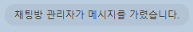
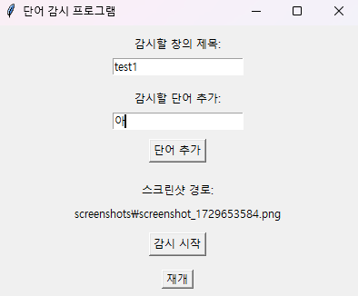
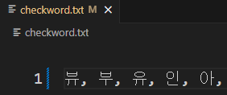
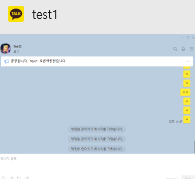
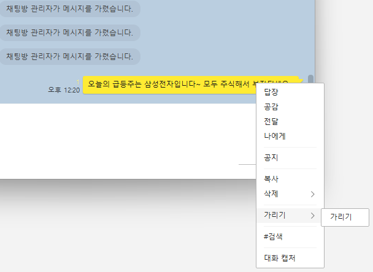

# hide_harmfulMessage



1. [🌟 개요](#-개요)
2. [🛠️ 기능](#-기능)
3. [📚 사용한 라이브러리](#-사용한-라이브러리)
4. [📸 작동사진](#-작동사진)
5. [🔍 참고 및 한계](#-참고-및-한계)

## 🌟 개요
hide_harmfulMessage는 해로운 메시지를 자동으로 감지하고 숨기는 프로그램입니다. 광고, 스팸 문자 등을 제거합니다.

## 🛠️ 기능
온라인 메신저 상에서 자동으로 문자를 탐지하여 숨김 처리할 수 있습니다.

## 📚 사용한 라이브러리

### 파이썬 표준 라이브러리
- **time**: 주기적인 작업 실행 및 지연 시간을 제어 [관련 문서](https://docs.python.org/3/library/time.html)
- **os**: 파일 시스템과 상호작용하고, 파일 및 디렉터리 경로를 관리 [관련 문서](https://docs.python.org/3/library/os.html)
- **logging**: 프로그램 실행 상태와 오류를 기록 [관련 문서](https://docs.python.org/3/library/logging.html)
- **warnings**: 프로그램 실행 중 경고 메시지를 처리 [관련 문서](https://docs.python.org/3/library/warnings.html)

### 오픈 라이브러리
- **pyautogui**: 마우스와 키보드의 자동화 제어 [관련 문서](https://pyautogui.readthedocs.io/)
```
  pip install pyautogui
```
  
- **cv2 (OpenCV)**: 이미지 및 비디오 처리 [관련 문서](https://opencv.org/)
```
  pip install cv2
```

- **numpy**: 수치 계산을 위한 라이브러리로, 이미지 데이터를 배열로 처리 [관련 문서](https://numpy.org/)
```
  pip install numpy
```
- **pytesseract**: Tesseract OCR 엔진을 사용하여 이미지에서 텍스트를 추출 [관련 문서](https://github.com/madmaze/pytesseract)
```
  pip install pytesseract
```
- **pywinauto**: 윈도우 GUI 애플리케이션을 자동화 [관련 문서](https://github.com/pywinauto/pywinauto)
```
  pip install pywinauto
```
- **win32gui**: 윈도우 GUI 창을 제어 [관련 문서](https://pypi.org/project/win32gui/)
```
  pip install win32gui
```
- **matplotlib.pyplot**: 그래프와 이미지를 시각화 [관련 문서](https://matplotlib.org/stable/api/pyplot_summary.html)

- **matplotlib.patches**: 이미지에 강조 표시를 하기 위해 도형 제작 [관련 문서](https://matplotlib.org/stable/api/patches_api.html)
```
  pip install matplotlib
```

## 📸 작동사진

### 🖥️ 메인 화면
- **설명**: 실행시 보이는 화면입니다. 감시할 창, 단어 추가, 스크린샷 경로, 시작, 일시정지, 재개를 체크합니다.



### ✏️ 단어 추가
- **설명**: 감시할 단어를 추가할 경우 txt 파일에 자동 추가, 저장됩니다.



### 🔍 감시할 창의 제목
- **설명**: 감시할 창은 window에서 즉시 확인 가능한 창 제목입니다. 하단 사진에서는 test1이 창의 제목입니다.



### 👀 숨기기
- **설명**: 단어 감지시 자동 숨기기가 진행됩니다.



## 🔍 참고 및 한계
1. 본 프로젝트는 학습 및 연습 목적으로 제작된 프로그램입니다.
2. 일부 수정이 이루어지면 다양한 온라인 메신저에서 적용이 가능합니다.
3. 본 프로젝트는 대중적으로 사용되는 카카오톡을 기준으로 개발 및 테스트되었습니다.
4. 작성자는 이 프로그램을 실제로 사용하지 않으며, 배포 및 유지 관리 계획은 없습니다.
5. 이 코드를 참고하거나 사용하는 것은 자유이지만, 발생하는 모든 법적 책임은 사용자 본인에게 있습니다.
6. 현재 OCR 기술의 한계로, 한 글자씩만 정확하게 인식할 수 있습니다. 여러 글자를 동시에 인식하는 기능은 향후 개선이 필요합니다.
